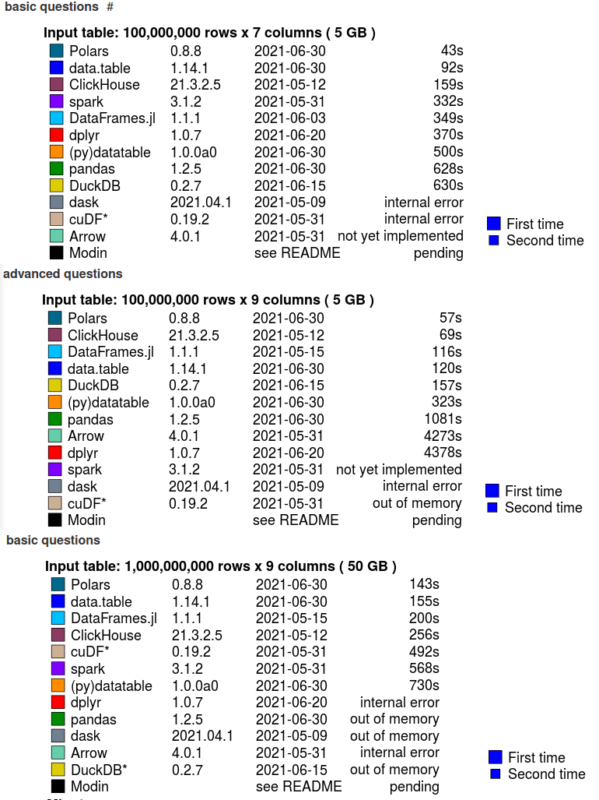

# polars中文教程🐻

    

> 本教程面向有一定python语言基础的数据爱好者，请保证python版本在3.6及以上

请在使用教程前安装`pip install polars`。

## 项目介绍
&emsp;&emsp;Polars 是一个速度极快的数据帧库，使用 [Apache Arrow](https://arrow.apache.org/) 列格式作为内存模型，以 [Rust](https://www.rust-lang.org/) 实现。正如其翻译过来的中文名是北极熊，它的特征是体型硕大、性格凶猛并且适合在恶劣环境生存，恰好对应于Polars的设计理念（功能强大），优势定位（稳定快速）与应用场景（大数据集），与 [Pandas](https://github.com/datawhalechina/joyful-pandas) （熊猫）"性格温顺"且不适应在"恶劣环境"生存等的特征形成鲜明对比。 在最近几年，Polars在处理大数据集上的优势逐渐显著，受到国外很多科研机构的喜爱，比如荷兰一家号称“水上特斯拉”的公司 [Xomnia](https://www.xomnia.com/) 就是该工具的赞助商。我们可以从下图看到，Polars的优势有多么明显：

    

但是如此快速的一个工具，却没有一个可供国内使用的中文教程。 所以本项目的目的在于，撰写一个针对该工具的教程，帮助更多的人了解到这个库。

&emsp;&emsp;我们热烈欢迎喜爱Python数据分析的各界人士加入这个项目，共同探讨如何使用`Polars`快速解决数据分析问题，成为里程碑中的一员。

## 网页版

## 大纲

    

## 项目进展

|章节|状态|要求|负责人|
|--|--|--|--|
|第一章 Python基础||||
|第二章 Numpy基础||||
|第三章 初识Polars||||
|第四章 Polars基础||||
|第五章 Polars进阶||||
|第六章 Polars高级||||
|第七章 附属生态||||

## 文件内容

* data： 数据集
* ebook： 教程电子版
* notebook： 教程jupyter notebook

## 参考资料

* 中文文档：[pola-rs/polars-book-cn](https://github.com/pola-rs/polars-book-cn)
* Datawhale出品：[Joyful-Pandas](https://github.com/datawhalechina/joyful-pandas)
* Polars [Python API](https://pola-rs.github.io/polars/py-polars/html/reference/)

## 人员安排

|成员|个人简介|社交主页|
|--|--|--|
|林景|武汉理工大学理学院数学系本科|[CSDN](https://blog.csdn.net/linjing_zyq) [Github](https://github.com/linjing-lab)|
|房子源|北京师范大学硕士 AI+教育方向|[CSDN](https://blog.csdn.net/qq_39354108) [Github](https://github.com/ziyuan0014)|
|陈煜昂|UMich CSE本科 Arch&PLT方向|[Github](https://github.com/Hilbert-Yaa) [Linkedin](https://www.linkedin.com/mwlite/in/hilbert-chen)|

## 关注我们

扫描下方二维码关注公众号：Datawhale

## LICENSE

 本作品采用<a rel="license" href="http://creativecommons.org/licenses/by-nc-sa/4.0/">知识共享署名-非商业性使用-相同方式共享 4.0 国际许可协议</a>进行许可。