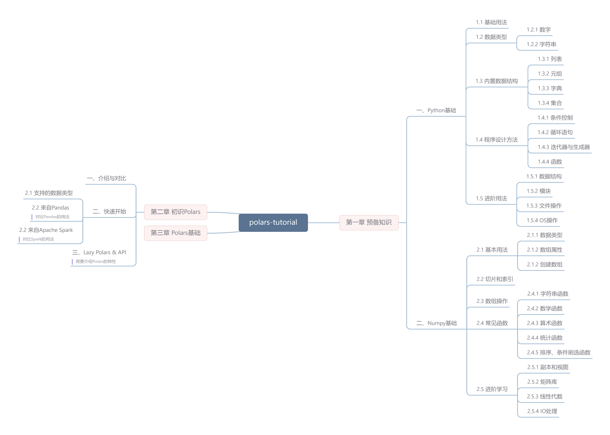

# Polars-Tutorial

    

> 本教程面向Python语言使用者，请保证python版本在3.6及以上

请在使用教程前安装&emsp;`pip install polars`.

## 网页版

## 大纲

    

## 论坛

## 文件内容

* data： 数据集
* ebook： 教程电子版
* notebook： 教程jupyter notebook

## 参考资料

* [pola-rs/polars](https://github.com/pola-rs/polars) 源码
* [Polars-User Guide](https://pola-rs.github.io/polars-book/user-guide/index.html) 官方文档

## 关注我们

## LICENSE

 本作品采用<a rel="license" href="http://creativecommons.org/licenses/by-nc-sa/4.0/">知识共享署名-非商业性使用-相同方式共享 4.0 国际许可协议</a>进行许可。