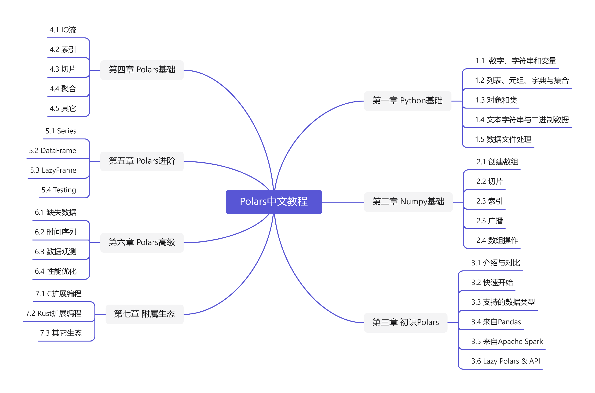

# Polars-Tutorial

    

> 本教程面向有一定Python语言基础的数据爱好者，请保证python版本在3.6及以上

请在使用教程前安装&emsp;`pip install polars`.

## 项目介绍
&emsp;&emsp;Polars是一个速度极快的数据帧库，使用[Apache Arrow](https://zhuanlan.zhihu.com/p/339132159)列格式作为内存模型，以[Rust](https://www.zhihu.com/question/393796866)实现。在最近几年，Polars在处理大数据集上的优势逐渐显著，受到国外很多科研机构的喜爱，比如荷兰一家号称“水上特斯拉”的公司[Xomnia](https://www.xomnia.com/)就是该工具的赞助商。我们可以从下图看到，Polars的优势有多么明显：

    

但是如此快速的一个工具，却在没有一个可供国内使用的中文文档。 所以本项目的目的在于，撰写一个针对该工具的教程，帮助更多的人了解到这个库。

&emsp;&emsp;我们热烈欢迎喜爱Python数据分析的各界人士加入这个项目，共同探讨如何使用`Polars`快速解决数据分析问题，成为里程碑中的一员。

## 网页版

## 大纲

    

## 项目进展
|章节|状态|要求|负责人|
|--|--|--|--|
|第一章 预备知识|1. 确定了文章大纲 2. 确定了撰写要求|1. 尽可能多编程举例 2. 文末注明参考文献|[林景](https://github.com/linjing-lab)|
|第二章 初识Polars|1. 撰写了大体内容 2. 等待扩充修改|1.尽可能多写Polars体验实例 2. 文末附上参考文献|[林景](https://github.com/linjing-lab)|
|第三章 Polars基础|暂未启动|暂未启动||

## PR要求（[PR教程](https://chinese.freecodecamp.org/news/how-to-make-your-first-pull-request-on-github/)）
* `fork`之后建立自己的分支，先在自己的分支上修改
* 必须先在`Jupyter notebook`中写，代码运行测试通过
* 每一章notebook下面必须附上写这篇文章的参考文献（采用规定格式）
* 文章需要的图片必须放在`docs/_images/`下，图片采用相对路径
* 数据集请放在`data/`下，命名好名称
* 尽量拓展每一章节的内容，发挥想象多举几个用例
* 项目初期尽量以研读官方文档为主，如果能够把数据分析的项目等改写成Pandas实现，那么后续再加入

## 文件内容

* data： 数据集
* ebook： 教程电子版
* notebook： 教程jupyter notebook

## 参考资料

* [pola-rs/polars](https://github.com/pola-rs/polars) 源码
* [Polars-User Guide](https://pola-rs.github.io/polars-book/user-guide/index.html) 官方文档
* [Python3基础教程](https://www.runoob.com/python3/python3-tutorial.html)
* [Numpy教程](https://www.runoob.com/numpy/numpy-tutorial.html)
* [Pandas教程](https://www.runoob.com/pandas/pandas-tutorial.html)
* [Spark教程](https://www.w3cschool.cn/spark/)
* [Datawhale出品：joyful-pandas](https://github.com/datawhalechina/joyful-pandas)

## 人员安排
|成员|个人简介|社交主页|
|--|--|--|
|林景|武汉理工大学理学院数学系|[CSDN](https://blog.csdn.net/linjing_zyq) [Github](https://github.com/linjing-lab)|

## 关注我们

扫描下方二维码关注公众号：Datawhale

## LICENSE

 本作品采用<a rel="license" href="http://creativecommons.org/licenses/by-nc-sa/4.0/">知识共享署名-非商业性使用-相同方式共享 4.0 国际许可协议</a>进行许可。